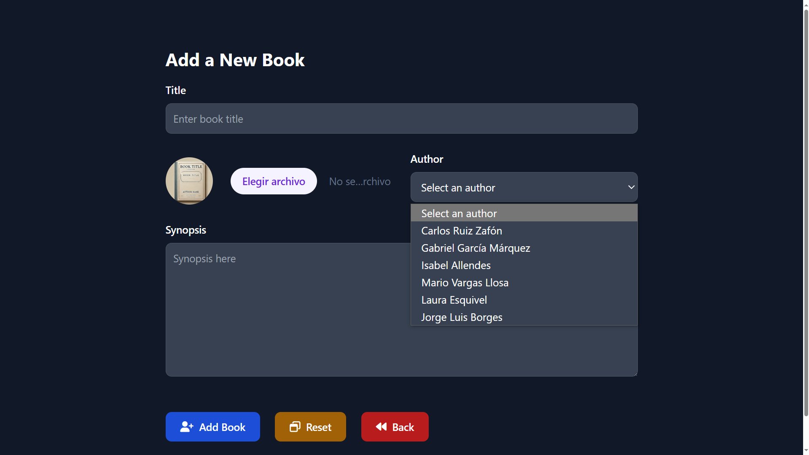
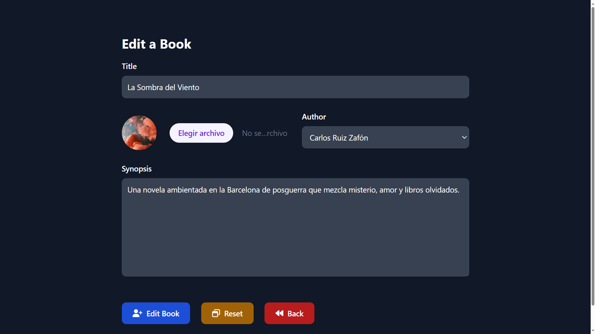
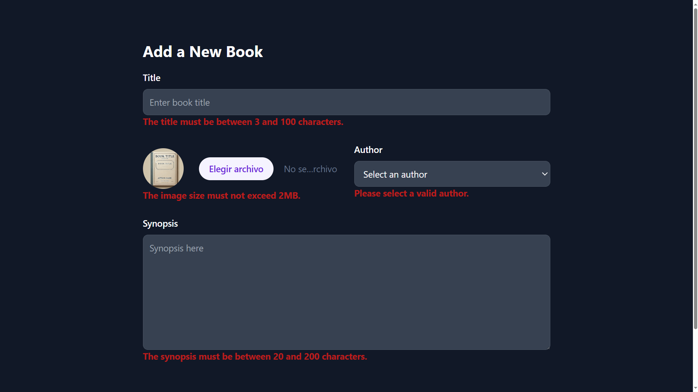
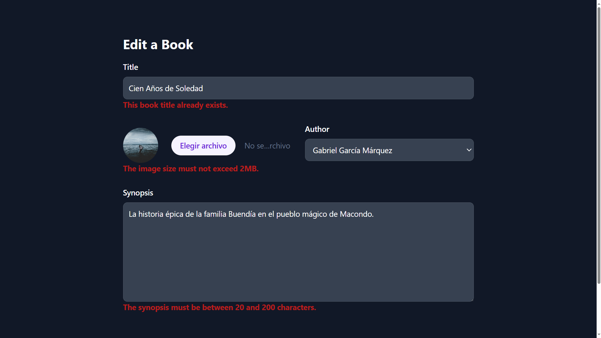
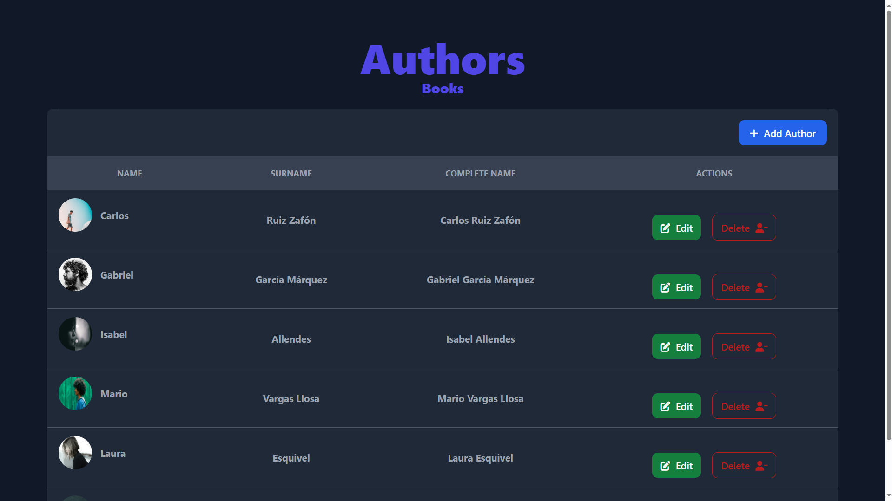
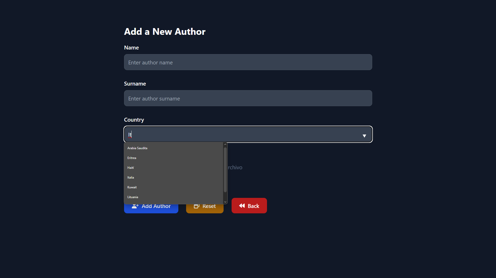

# **CRUD_Books**

## Tabla de Contenidos

- [Introducción](#introducción)
- [Características](#características)
- [Tecnologías Usadas](#tecnologías-usadas)
- [Instrucciones de Configuración](#instrucciones-de-configuración)
- [Uso](#uso)
- [Capturas de Pantalla](#capturas-de-pantalla)
- [Estructura del Código](#estructura-del-código)
- [Contribución](#contribución)
- [Licencia](#licencia)

---

## Introducción

**CRUD_Books** es una plataforma basada en la web que permite a los usuarios crear, actualizar, eliminar y ver libros y autores. La aplicación incluye formularios de validación y operaciones CRUD completas para los libros y autores. Además, el sistema gestiona imágenes asociadas y genera datos ficticios para pruebas rápidas.

Este sistema es ideal para demostrar operaciones CRUD y buenas prácticas de desarrollo PHP, incluyendo validación, manejo de sesiones y gestión de imágenes.

---

## Características

### Características para Usuarios

- Listar libros con detalles como título, sinopsis y autor.
- Crear nuevos libros con título, sinopsis, imagen de portada y autor seleccionado.
- Editar libros existentes con validación de entradas.
- Eliminar libros con un cuadro de confirmación.
- Listar autores con información completa (nombre, apellido y país).
- Crear y actualizar autores con validación de datos e imágenes.
- Eliminar autores con un cuadro de confirmación.

---

## Tecnologías Usadas

### Frontend

- **HTML5** y **CSS3** para estructura y estilo.
- **Tailwind CSS** para diseño responsivo.
- **SweetAlert2** para alertas y modales interactivos.
- **Font Awesome** para íconos.

### Backend

- **PHP 8.1+** para la lógica del lado del servidor.
- **Faker Library** para generar datos ficticios.

### Base de Datos

- **MySQL** para almacenamiento persistente de datos.

---

## Instrucciones de Configuración

### Requisitos Previos

- PHP 8.1 o superior.
- MySQL.
- Composer.
- Un servidor web (Apache).

### Pasos

1. **Clonar el repositorio:**

   ```bash
   git clone https://github.com/Omatple/CRUD_Books.git
   cd CRUD_Books
   ```

2. **Actualizar dependencias:**

   ```bash
   composer update
   ```

3. **Configurar la base de datos:**
   - Crear una nueva base de datos en MySQL.
   - Importar las tablas de la base de datos desde `database/tables.sql`.

4. **Configurar el entorno:**
   - Renombrar `.env.example` a `.env`.
   - Actualizar las credenciales de la base de datos en el archivo `.env`:

     ```env
     HOST=localhost
     PORT=3306
     DBNAME=<tu_base_de_datos>
     USERNAME=<tu_usuario>
     PASSWORD=<tu_contraseña>
     ```

5. **Ejecutar la aplicación:**
   - Asegúrate de que Apache esté apuntando al directorio público (`public/`).
   - Visitar `http://localhost` en tu navegador.

6. **Generar datos ficticios (opcional):**
   - Ejecutar el script para poblar la base de datos con datos de prueba.

     ```bash
     php scripts/generateFakeBooks.php
     ```

---

## Uso

### Funcionalidades del Usuario

1. **Listar Libros:**
   - Ver todos los libros existentes con sus detalles.

2. **Crear Libros:**
   - Acceder al formulario para añadir libros con confirmación de alerta.
   - Completar título, sinopsis, autor y subir una imagen de portada.

3. **Editar Libros:**
   - Actualizar los detalles de un libro seleccionado con confirmación de alerta.

4. **Eliminar Libros:**
   - Eliminar un libro con confirmación de alerta.

5. **Administrar Autores:**
   - Crear, editar y eliminar autores con validación y manejo de imágenes.

---

## Capturas de Pantalla

### Listado de Libros


### Formulario para Añadir Libro



### Formulario para Editar Libro



### Mensaje de Confirmación - Eliminación de Libro


### Errores en Formulario de Creación de Libro



### Errores en Formulario de Actualización de Libro



### Listado de Autores



### Formulario para Añadir Autor



### Formulario para Editar Autor


### Mensaje de Confirmación - Eliminación de Autor


### Errores en Formulario de Creación de Autor


### Errores en Formulario de Actualización de Autor


---

## Estructura del Código

### Carpetas

- **`App/Database`:** Clases para gestionar la base de datos de libros y autores.
- **`App/Utils`:** Clases utilitarias para validación, manejo de imágenes, navegación y sesiones.
- **`public/`:** Archivos accesibles públicamente, como imágenes y scripts.
- **`public/screenshots/`:** Capturas de pantalla del proyecto.

### Estructura

```
CRUD_Books/
├── database/
│   ├── tables.sql                          # Script SQL para crear las tablas necesarias.
├── public/
│   ├── authors/
│   │   ├── img/                            # Imágenes asociadas a los autores.
│   │   ├── authors.php                     # Listado de autores.
│   │   ├── delete.php                      # Elimina un autor existente.
│   │   ├── new.php                         # Formulario para añadir un autor.
│   │   ├── update.php                      # Formulario para editar un autor.
│   ├── books/
│   │   ├── img/                            # Imágenes asociadas a los libros.
│   │   ├── books.php                       # Listado de libros.
│   │   ├── delete.php                      # Elimina un libro existente.
│   │   ├── new.php                         # Formulario para añadir un libro.
│   │   ├── update.php                      # Formulario para editar un libro.
│   ├── js/
│   │   ├── handlerPreviewImage.js          # Script para previsualizar imágenes en formularios.
│   ├── screenshots/                        # Capturas de pantalla del proyecto.
│   ├── index.php                           # Página principal.
├── scripts/
│   ├── generateFakeBooks.php               # Script para generar datos ficticios.
├── src/
│   ├── Database/
│   │   ├── AuthorRepository.php            # Operaciones CRUD relacionadas con autores.
│   │   ├── BookRepository.php              # Operaciones CRUD relacionadas con libros.
│   │   ├── Connection.php                  # Clase para gestionar la conexión a la base de datos.
│   │   ├── QueryExecutor.php               # Ejecuta consultas SQL.
│   ├── Utils/
│   │   ├── AuthorValidator.php             # Valida datos de autores.
│   │   ├── BookValidator.php               # Valida datos de libros.
│   │   ├── Country.php                     # Enumera países válidos.
│   │   ├── ImageConstants.php              # Constantes relacionadas con imágenes.
│   │   ├── ImageProcessor.php              # Procesa imágenes (subida, borrado, etc.).
│   │   ├── InputValidator.php              # Sanitiza y valida entradas de formularios.
│   │   ├── Navigation.php                  # Gestiona redirecciones.
│   │   ├── SessionErrorDisplay.php         # Muestra errores almacenados en sesión.
│   │   ├── SweetAlertDisplay.php           # Muestra alertas usando SweetAlert2.
├── vendor/                                 # Dependencias instaladas mediante Composer.
├── .env                                    # Configuraciones del entorno.
├── .gitignore                              # Archivos ignorados por Git.
├── composer.json                           # Configuración de Composer.
├── composer.lock                           # Bloqueo de versiones de dependencias.
├── env.example                             # Ejemplo de archivo de entorno.
├── LICENSE                                 # Licencia del proyecto.
├── README.md                               # Documentación del proyecto.

```

---

## Contribución

1. Realiza un fork del repositorio.
2. Crea una rama de características:

   ```bash
   git checkout -b feature/new-feature
   ```

3. Realiza tus cambios y haz commits:

   ```bash
   git commit -m "Agregada nueva funcionalidad"
   ```

4. Envía tus cambios al repositorio original y crea un Pull Request.

---

## Licencia

Este proyecto está licenciado bajo la [Licencia MIT](LICENSE.txt).
